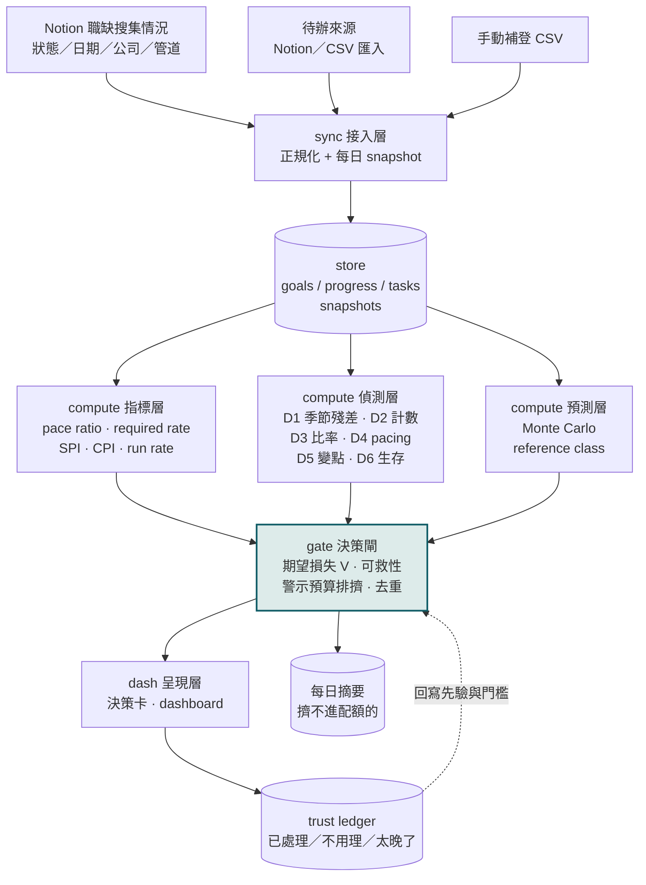
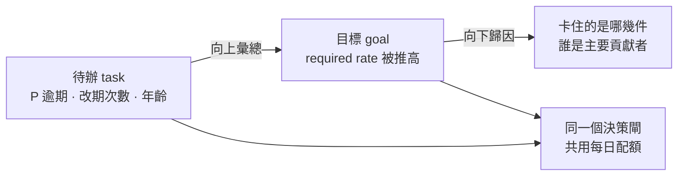

# 架構

> 本檔記系統架構、模組職責與資料流。門檻值一律不寫在這裡，正本在 `config/params.yaml`。
> 決策規則與流程見 `DECISION-FLOW.md`；資料 schema 見 `DATA-CONTRACT.md`。

## 一句話

**警示不是通知，是一次對人類注意力的支出。** 系統回答的不是「這個數字奇怪嗎」，
而是「這件事值不值得現在打斷你、打斷了你該做什麼、不做會賠多少」。

## 系統架構



**唯一往回的箭頭是 trust ledger 回到決策閘。** 那條回饋線是這個系統會不會隨時間變好的
全部原因——沒有它，門檻只能靠人手動調，而那正是市面工具需要 4–8 週調校的原因。

## 模組職責

| 模組 | 職責 | 明確不做 |
|------|------|---------|
| `core/` | 參數載入（`params.yaml` → 唯讀物件）、資料模型、日界換算 | **不做任何判斷**，也不回寫參數 |
| `sync/` | 接 Notion 與 CSV，正規化成三張表，每日 snapshot | 不做任何判斷與計算 |
| `compute/` | 指標、偵測器、預測。輸出「候選警示 ＋ 機率 ＋ 證據」 | **不決定要不要發** |
| `gate/` | 期望損失、可救性、配額排擠、去重、冷啟動關卡 | 不計算指標，只消費 compute 的輸出 |
| `dash/` | 決策卡、dashboard、每日摘要 | 不做過濾（該濾的在 gate 濾完了） |
| `ledger/` | 記錄回饋、更新先驗與門檻、產月報 | 不直接改 `config/params.yaml`（學到的存 ledger，參數是人的意志） |

**`compute` 與 `gate` 的分界是本專案最重要的一條界線。** compute 回答「發生了什麼」，
gate 回答「值不值得說」。混在一起就會出現「因為這個統計顯著所以發出去」——
而統計顯著與值不值得打斷你是兩件事。

## 資料流

```
① 每日 23:00  sync 拉 Notion → 寫入 snapshots（各狀態計數）
② 差分還原    今日 snapshot − 昨日 snapshot → progress.delta
③ 指標計算    goals × progress → pace ratio / required rate / SPI
④ 偵測        run rate 序列 → EWMA / CUSUM → 候選警示
⑤ 預測        bootstrap daily delta → P(達成) + 完成日區間
⑥ 決策閘      V = P × 損失 × 時間衰減 × 可救性 − 打斷成本 → 排序 → 取前 N
⑦ 輸出        決策卡（前 N）＋ 每日摘要（其餘）＋ dashboard 重繪
⑧ 回饋        使用者按鈕 → ledger → 明日的先驗
```

第 ② 步是本專案最特別的一段：**Notion 的 status 變更沒有時間戳**，
所以「現在有幾筆已投遞」拿得到（存量），「今天投了幾筆」拿不到（流量）。
目標偏移需要的正是流量，因此靠每日快照的差分還原。
代價：漏跑一天就會把兩天的量記在同一天，`sync` 必須偵測 gap 並標記。

## 待辦與目標的連結（雙向）

待辦警示**不是獨立功能**。它與目標偏移共用同一個決策閘，而且兩者互為因果：



三個具體的連結點：

1. **結構連結**：`tasks.goal_id` 把待辦掛到目標上。一個「8 月投 60 份」的目標
   由 N 件「投遞 X 公司」的待辦組成
2. **向上彙總**：待辦的延遲會推高父目標的 required run rate。
   **所以待辦延遲不只是待辦的問題，它是目標可行性的領先指標**
3. **向下歸因**：目標觸發「可行性翻轉」時，決策卡必須指出是哪幾件待辦卡住的——
   否則使用者只知道「來不及了」，不知道要動哪裡

**共用配額是連結最實際的體現**：不是待辦系統與目標系統各發各的，是同一個閘門排序後
取前 N。一件快到期的待辦可能擠掉一個目標偏移警示，反之亦然——**這正是「注意力是預算」
的意思**。若兩者各有配額，總量就翻倍，警示疲勞照樣發生。

## 六個偵測器（型錄）

| # | 偵測器 | 適用 | 方法 | M1 |
|---|--------|------|------|-----|
| D1 | 季節性殘差 | 有週期的連續量 | STL → 殘差 ÷ MAD | M2 |
| D2 | 計數型偏離 | 整數、可能稀疏 | Poisson exact／Negative Binomial | ✅ |
| D3 | 比率型偏離 | 有界 [0,1] | Wilson 區間，分母不足不發 | M2 |
| D4 | 累積 pacing | 單調累積量 | 外推 → 期末預測區間 vs 目標 | ✅ |
| D5 | 變點 | 任何型態 | EWMA／CUSUM ＋ Western Electric | ✅ |
| D6 | 生存分析 | 個體級有事件定義 | Kaplan–Meier／Cox | M2 |

> **D1 與 D3 原訂 M1，實作時退回 M2**（← `prepare.md` AG-008）：D1 要 `statsmodels`（M2 依賴）
> 且 42 天門檻套在 31 天的月目標上永遠在校準中；D3 要漏斗分母，而 `progress.csv` 沒有分母欄位。
> 兩者現在做出來都無法驗證。
>
> **D2 不單獨成一則警示**：「近 7 天比平常少」本身沒有行動可做，要接到「所以做不完了」才有。
> 所以 D2 的角色是把統計佐證掛到 D4／D5 的觸發上。

**D5 永遠與其他並聯**：D1–D4 問「今天偏離正常嗎」，只有 D5 問「正常本身變了嗎」。
後者是前者結構上抓不到的——滾動基線會慢慢把新常態吸收進去，然後安靜下來。

### 為什麼六個就夠，而且 v1 不用 ML

監控要的是穩健、可解釋、不需重訓，不是最低 MAE。而且：

> **在監控場景，模型越強，越容易把異常正常化。**

LSTM／Transformer 的優點是適應性強，而適應性正是監控的敵人——它會把上個月的異常
學成「這條線本來就長這樣」，然後從此不再報。穩健統計因為頑固，反而做得對。

另一個理由是可解釋性：使用者判斷「這則警示對不對」是本系統唯一無法自動化的環節
（見 `DECISION-FLOW.md` 的三種情境錯誤），而黑箱模型會直接剝奪這個能力。

## 技術棧

| 層 | 選型 | 為什麼不用更潮的 |
|----|------|-----------------|
| 語言 | Python 3.11+ | — |
| 計算 | pandas + numpy（+ scipy 統計分佈） | 資料量在萬列等級，DuckDB 是 M2 資料變大才需要 |
| 偵測 | 自寫 EWMA／CUSUM（各約 40 行） | statsmodels 只為了 STL 值得裝，其餘自寫更好讀 |
| 預測 | numpy bootstrap | 不用 Prophet：依賴重，且對這個資料量沒有優勢 |
| 設定 | PyYAML | — |
| 呈現 | Jinja2 → 靜態 HTML ＋ inline SVG | **零 JS 依賴、零外部資源**，可直接發布成 artifact 或用瀏覽器開 |
| 儲存 | CSV（M1）→ SQLite（M2） | M1 資料量小到 CSV 就夠，且人眼直接讀得懂、改得動 |
| 排程 | 本機 cron／手動執行 | 不用 GitHub Actions：資料是個人求職記錄，不能離開本機 |

## 目錄結構

```
goal-drift-alert/
├── config/params.yaml        # 所有門檻的唯一真相
├── data/
│   ├── examples/             # 版控內的範例資料（唯一進 repo 的資料）
│   ├── goals.csv             # gitignored
│   ├── progress.csv          # gitignored
│   ├── tasks.csv             # gitignored（M2）
│   └── snapshots/            # gitignored
├── docs/                     # ARCHITECTURE／DATA-CONTRACT／DECISION-FLOW／DASHBOARD
├── core/
│   ├── config.py             # params.yaml → 唯讀物件，取不到就爆
│   └── models.py             # Goal／ProgressEntry／SnapshotRow／Issue
├── sync/
│   ├── loader.py             # goals.csv／progress.csv
│   ├── snapshot.py           # 每日快照 ＋ 差分還原流量
│   ├── notion.py             # Notion 抓取（獨立執行，不在報表路徑上）
│   └── quality.py            # 關卡 0 契約檢查、關卡 1 資料體檢
├── compute/
│   ├── metrics.py            # pace ratio／required／run rate／SPI／歷史最佳 P90
│   ├── forecast.py           # bootstrap Monte Carlo
│   ├── detect.py             # D2／D4／D5 → 四個觸發
│   └── report.py             # 每日執行入口（python3 -m compute.report）
├── gate/
│   ├── value.py              # V 公式與可救性
│   ├── rules.py              # 三個不該警示的時刻 ＋ 冷啟動分級
│   └── pipeline.py           # 去重 → 排擠 → 取前 N
├── dash/
│   ├── card.py               # 決策卡
│   └── summary.py            # 每日摘要（被擋掉的那些）
└── out/                      # 產出（gitignored）
```

## 里程碑

| 階段 | 交付 | 出口條件（不過就停） |
|------|------|--------------------|
| **M0** 骨架 | 文件、參數、schema、範例資料 | 本次 PR |
| **M1** 目標偏移 | sync ＋ pace ratio／required rate／SPI ＋ 決策卡 | 跑得出「8 月投遞」的真實數字，且**至少一則警示讓你覺得「幸好它說了」** |
| **M2** 待辦風險 | tasks 接入、三風險原型、與目標雙向連結 | 目標的可行性翻轉能指出是哪幾件待辦卡住 |
| **M3** 決策閘完整版 | 期望損失、配額排擠、trust ledger、回放 | 回放過去 90 天，三條門檻策略的挽回曲線分得開 |
| **M4** Dashboard | 靜態 HTML 全套視圖 | 一個沒看過的人 3 分鐘內講得出你的差異化 |
| **M5** 通用化 | 指標契約 YAML、場景模板庫、LINE 通道 | **前置條件是 M3 通過**——沒有被證明有效的場景就開放泛用只會得到空殼 |
